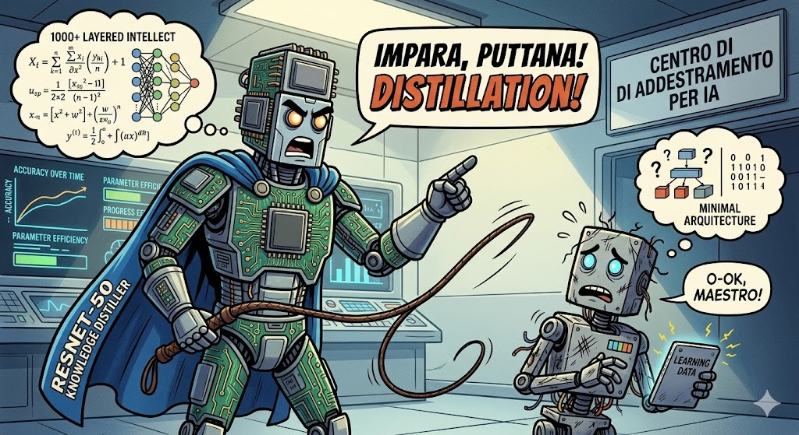

# Knowledge Distillation for Mobile Action Recognition

[](docs/REPORT.md)
[](LICENSE)



## 👥 Group and Project Information

- **Group ID**: G24
- **Project ID**: 6

## 📝 Project Description

This project implements Knowledge Distillation (KD) to compress a 3D ResNet-50 teacher model into an ultra-lightweight MobileNet3D student for video action recognition on UCF-101. The teacher is pretrained on Kinetics-400 and fine-tuned on UCF-101; the student learns from the teacher's soft probability distributions to maintain respectable temporal reasoning while reducing the parameter count by 5–10x. The project includes standard logit-based KD, Attention Transfer, temperature ablation studies, and t-SNE latent space visualizations.

> 📖 **Official Report**: For all theoretical details, performance analysis, the architecture used, and group contributions, please refer to our formal paper: **[REPORT.md](docs/REPORT.md)**.

## 🛠 Technical Reproducibility

### 1. Data and Environment Setup

**Prerequisites:**

```bash
git clone https://github.com/yourusername/your-repo.git
cd your-repo
conda env create -f environment.yml
conda activate dl-project
```

**Dataset:**
Download UCF-101 from https://www.crcv.ucf.edu/data/UCF101.php. Extract the videos into `data/UCF-101/` and the train/test split files into `data/ucfTrainTestlist/`.

```
data/
├── UCF-101/
│   ├── ApplyEyeMakeup/
│   │   ├── v_ApplyEyeMakeup_g01_c01.avi
│   │   └── ...
│   └── ...
└── ucfTrainTestlist/
    ├── classInd.txt
    ├── trainlist01.txt
    └── testlist01.txt
```

### 2. Network Training

All training scripts accept YAML config files and optional CLI overrides:

**Step 1 — Fine-tune the Teacher (3D ResNet-50):**

```bash
python -m src.training.train --config experiments/configs/teacher.yaml
```

**Step 2 — Train Baseline Student (MobileNet3D from scratch):**

```bash
python -m src.training.train --config experiments/configs/baseline.yaml
```

**Step 3 — Knowledge Distillation (Logit-based):**

```bash
python -m src.training.train --config experiments/configs/distillation.yaml
```

**Step 4 — Knowledge Distillation + Attention Transfer:**

```bash
python -m src.training.train --config experiments/configs/attention_transfer.yaml
```

**Override any config parameter from CLI:**

```bash
python -m src.training.train --config experiments/configs/distillation.yaml --override training.lr=0.005 distillation.temperature=10
```

### 3. Evaluation

```bash
python -m src.evaluation.evaluate --config experiments/configs/baseline.yaml --override evaluation.checkpoint=experiments/checkpoints/baseline_best.pth
python -m src.evaluation.evaluate --config experiments/configs/teacher.yaml --override evaluation.checkpoint=experiments/checkpoints/teacher_finetune_best.pth
python -m src.evaluation.evaluate --config experiments/configs/distillation.yaml --override evaluation.checkpoint=experiments/checkpoints/distillation_best.pth
```

---

_For the declaration of individual tasks and the use of AI, refer to `docs/REPORT.md`._
