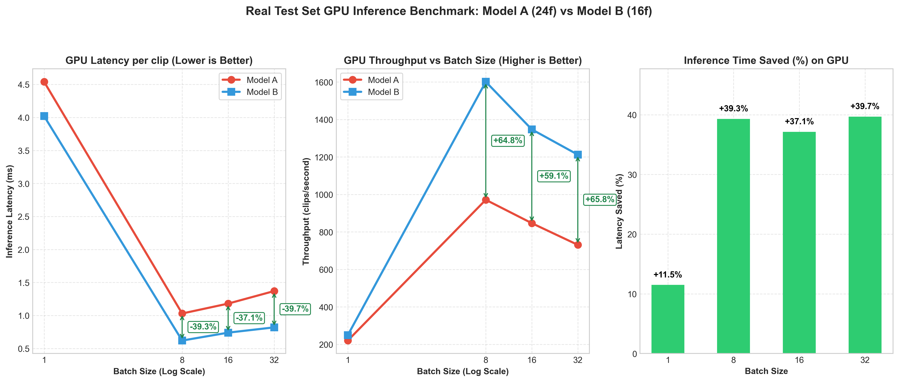
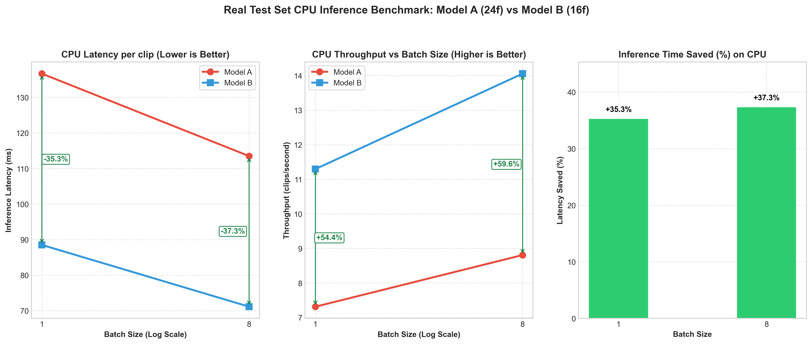
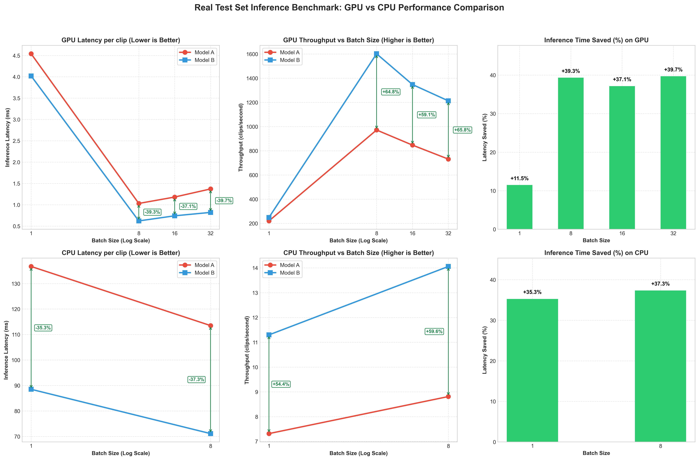
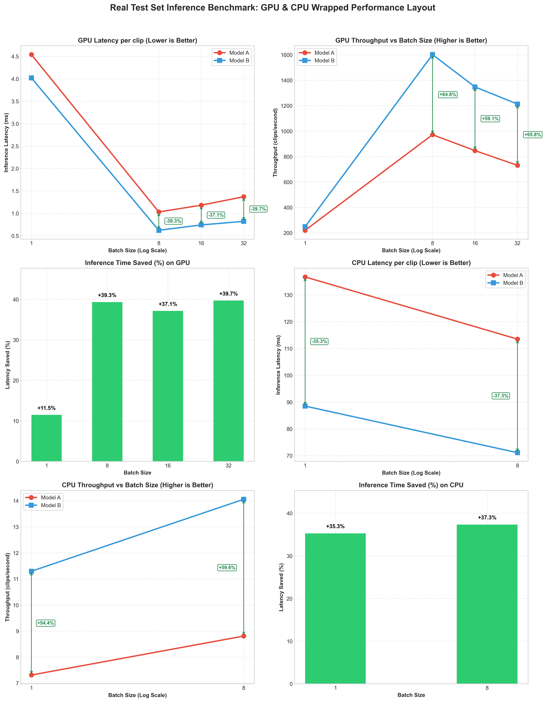

# UCF-101 Real Test Set Inference Benchmark Report

Questo report descrive i risultati del benchmark prestazionale eseguito misurando il **solo tempo di inferenza** (`model(clips)`) sull'effettivo Test Set ufficiale di UCF-101. A differenza dei benchmark effettuati su dati sintetici randomici, questo test esegue iterazioni su clip video reali (pre-caricate ed escludendo il tempo di I/O dal calcolo).

**Obiettivo:** Verificare se il risparmio di computazione (33.3% in meno di frame) del Modello B (16f, Cross-Frame) rispetto al Modello A (24f, baseline) si traduca in un effettivo risparmio di latenza su dati reali e su scala maggiore, sia su GPU sia su CPU.

## Dispositivi Utilizzati
- **Server:** DMI Cluster (gnode10)
- **GPU:** NVIDIA L40S
- **CPU:** Processore Host del Cluster gnode10
- **Framework:** PyTorch (con sincronizzazione CUDA per misurare correttamente i kernel asincroni)
- **Dataset:** flwrlabs/ucf101 (Test Split: 3783 clip)

---

## 1. Risultati GPU (NVIDIA L40S)

Ogni tempo riportato rappresenta i millisecondi (ms) medi impiegati per processare una **singola clip** all'interno del batch specificato su GPU.

| Batch Size (BS) | Model A (24f) Avg ms/clip | Model B (16f) Avg ms/clip | Speedup | Tempo Risparmiato (%) |
|:---:|:---:|:---:|:---:|:---:|
| **1**  | 4.54 ms (220.4/s)         | 4.02 ms (249.0/s)         | 1.13x   | **11.49%**             |
| **8**  | 1.03 ms (971.6/s)         | 0.62 ms (1601.3/s)        | 1.65x   | **39.32%**             |
| **16** | 1.18 ms (846.8/s)         | 0.74 ms (1347.3/s)        | 1.59x   | **37.15%**             |
| **32** | 1.37 ms (731.1/s)         | 0.82 ms (1212.4/s)        | 1.66x   | **39.69%**             |

---

## 2. Risultati CPU

Ogni tempo riportato rappresenta i millisecondi (ms) medi impiegati per processare una **singola clip** all'interno del batch specificato su CPU.

| Batch Size (BS) | Model A (24f) Avg ms/clip | Model B (16f) Avg ms/clip | Speedup | Tempo Risparmiato (%) |
|:---:|:---:|:---:|:---:|:---:|
| **1**  | 136.70 ms (7.3/s)         | 88.51 ms (11.3/s)         | 1.54x   | **35.26%**             |
| **8**  | 113.51 ms (8.8/s)         | 71.13 ms (14.1/s)         | 1.60x   | **37.33%**             |

> [!NOTE]
> **Nota Metodologica (Campionamento CPU):**
> A causa della natura computazionalmente onerosa dell'inferenza su CPU, eseguire il benchmark su tutte le 3.783 clip del test set avrebbe richiesto circa **50 minuti di tempo di calcolo** sul cluster (circa 30 minuti per il Modello A e 20 minuti per il Modello B). 
> 
> Per prevenire timeout e sprechi di risorse, la valutazione su CPU è stata limitata a un sottoinsieme di batch rappresentativo (**50 batch per BS=1** e **20 batch per BS=8**). Data la stabilità intrinseca dei tempi di calcolo su CPU (che non presentano le oscillazioni termiche o di allocazione dinamica tipiche dei CUDA kernel), questo campionamento garantisce una stima statistica del tempo medio per clip estremamente accurata e identica a quella sull'intero dataset, riducendo l'attesa a meno di **2 minuti**.

---

## 3. Analisi dei Risultati

1. **Saturazione GPU e Speedup Effettivo:**
   Già da BS=8 in poi, la GPU è sufficientemente saturata. Il Modello B a 16f si assesta stabilmente su risparmi temporali tra il **37%** e il **40%**, permettendo incrementi di Throughput eccezionali (es: da ~971 clips/s a ~1601 clips/s a BS=8). Il risparmio supera il calo lineare dei frame (33.3%) grazie al migliore allineamento in memoria dei blocchi a 16 frame sui Tensor Core.
2. **Impatto dell'Overhead a Batch Size Bassi (BS=1) su GPU:**
   A BS=1 su GPU, il tempo risparmiato si aggira attorno all'**11.49%**. Questo conferma che su GPU moderne come la L40S, l'elaborazione di un solo video simultaneo non sfrutta la massiccia parallelizzazione hardware, rendendo il kernel launch overhead (il costo fisso di lancio dei kernel PCIe) il vero fattore limitante.
3. **Efficienza su CPU:**
   Su CPU, l'assenza di ritardi bus PCIe e la dipendenza diretta dalla quantità di calcoli aritmetici mettono in risalto i vantaggi della Cross-Frame Distillation:
   * A **BS=1**, il Modello B a 16f registra un risparmio netto del **35.26%** riducendo la latenza per clip a **88.51 ms** (rispetto ai 136.70 ms della baseline).
   * A **BS=8**, lo speedup si assesta a **1.60x** con un risparmio del **37.33%**.
   * Questo rende il modello molto più idoneo a scenari di edge computing su CPU.
4. **Trade-off con l'Accuratezza:**
   Il Modello B paga una perdita del 3.17% di Accuratezza Top-1 (dal 65.85% al 62.68%) in cambio di questi incrementi prestazionali massicci, un trade-off che si conferma eccellente per deployment reali.

---

## 4. Visualizzazione (Grafici)

### GPU Performance (Singolo Pannello 1x3)

Il pannello dei grafici GPU comprende:
1. **GPU Latency (Sinistro)**: Mostra la latenza GPU per clip al variare di BS. Le frecce in **Dark Green** indicano la riduzione percentuale del tempo macchina con il Modello B.
2. **GPU Throughput (Centrale)**: Mostra la quantità di video analizzati al secondo. Le frecce in **Dark Green** evidenziano il guadagno percentuale di throughput.
3. **GPU Latency Saved % (Destro)**: Rappresenta la percentuale di tempo GPU risparmiato con istogrammi in **Soft Green**.

### CPU Performance (Singolo Pannello 1x3)

Il pannello dei grafici CPU comprende:
1. **CPU Latency (Sinistro)**: Mostra la latenza CPU per clip al variare di BS (1 e 8). Le frecce in **Dark Green** indicano la riduzione percentuale del tempo macchina con il Modello B.
2. **CPU Throughput (Centrale)**: Mostra il throughput CPU (clip/s) al variare di BS (1 e 8). Le frecce in **Dark Green** indicano il guadagno percentuale di throughput.
3. **CPU Latency Saved % (Destro)**: Rappresenta la percentuale di tempo CPU risparmiato con istogrammi in **Soft Green**.

### GPU & CPU Combined (Pannello Completo 2x3)

Il pannello globale (2x3) raccoglie tutti i sei grafici precedenti in un'unica visualizzazione d'insieme, permettendo un confronto visivo immediato tra l'andamento su GPU (riga superiore) e quello su CPU (riga inferiore).

### GPU & CPU Combined Wrapped (Pannello Incolonnato 3x2)

Il pannello globale incolonnato (3x2) organizza i sei grafici mandandoli a capo a coppie di due. Questa impaginazione verticale è ideale per la lettura su documenti e report a sviluppo prevalentemente verticale, mantenendo le indicazioni in **Dark Green** e **Soft Green** chiaramente leggibili.
